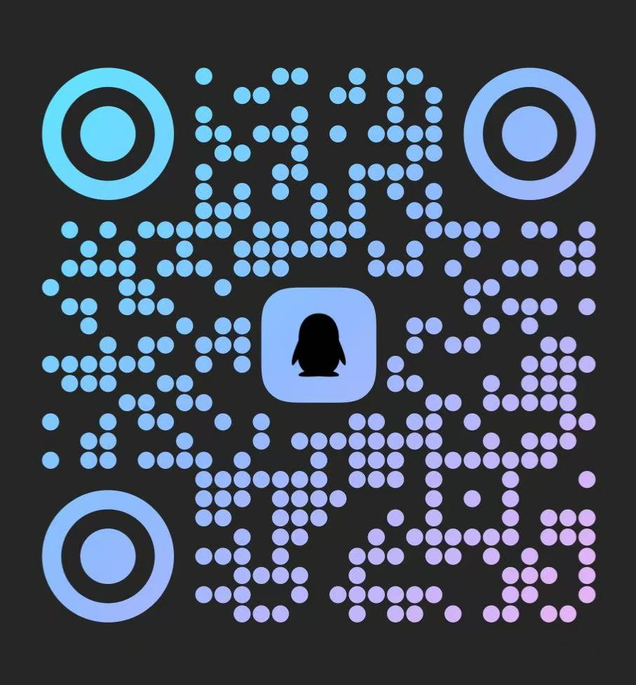

<h1 align="center"> Halo Theme Fuwari  </h1>

---

<div align="center">  

一款 [Halo2.0](https://github.com/halo-dev/halo) 的博客主题  
移植于 Astro  [fuwari](https://github.com/saicaca/fuwarik)同名主题

</div>

<p class="badge-row" align="center">
  <a href="https://halo.run" target="_blank">
    
  </a>
  <a href="https://github.com/jiewenhuang/halo-theme-fuwari/releases" target="_blank">
    
  </a>
  <a href="https://github.com/jiewenhuang/halo-theme-stack/blob/main/LICENSE" target="_blank">

  </a>  </a>
</p>

### 预览：[Jiewen's Blog](https://www.jiewen.run/?preview-theme=theme-fuwari)


### 安裝
直接通过后台应用市场安装或者下载[releases](https://github.com/jiewenhuang/halo-theme-stack/releases)，通过 Halo Console 后台主题安装处上传即可。

### 插件支持
Fuwari 主题支持以下 Halo 插件：

- [x] 搜索插件：https://www.halo.run/store/apps/app-DlacW
- [x] 评论插件：https://www.halo.run/store/apps/app-YXyaD


为了获得更好的体验，你还可以安装以下插件（如果需要）：

- highlight.js 代码高亮：https://halo.run/store/apps/app-sqpgf
- lightgallery.js 灯箱：https://halo.run/store/apps/app-OoggD


### 使用说明
> 1、部分功能是使用插件进行支持  
- [x] 卡片化设计
- [x] 响应式主题
- [x] 深色模式
- [ ] 文章目录
- [X] [代码高亮/语言/复制](https://github.com/halo-sigs/plugin-highlightjs)（插件）
- [x] [文章搜索](https://github.com/halo-sigs/plugin-search-widget)（插件）
- [x] 显示字数统计
- [X] [评论系统](https://github.com/halo-sigs/plugin-comment-widget)（插件）
- [x] [友情链接](https://github.com/halo-sigs/plugin-links)
- [x] i18n国际化
- [x] 其他功能

### TODO
- [ ] 图库（/photos）：https://halo.run/store/apps/app-BmQJW
- [ ] 瞬间（/moments）：https://halo.run/store/apps/app-SnwWD
- [ ] 文章目录
- [ ] 优化暗亮色切换闪烁问题
### 开发

```bash
cd ~/halo2-dev/themes/theme-fuwari
```

```bash
pnpm install 
```

```bash
pnpm dev
```

### 🏭 贡献

> 我一个人的时间有限，只是业余有时间写写，如果你想帮助完善 `fuwari` 主题，请：

- 点 `star`
- 提 `issue`
- 修 `bugs`
- 推 `pr`

<br>

### 🙆‍♂️ 感谢

在此感谢以下项目提供的支持：

- [Halo](https://halo.run)
- [Fuwari](https://github.com/saicaca/fuwari)

- [plugin-links](https://github.com/halo-sigs/plugin-links)
- [plugin-comment-widget](https://github.com/halo-sigs/plugin-comment-widget)
- [plugin-search-widget](https://github.com/halo-sigs/plugin-search-widget)
-
- ......

<br>  

### QQ交流群

QQ群号（929708466）欢迎大家前来交流分享



### TinyTale Halo2 配套小程序

[TinyTale](https://www.jiewen.run/archives/TinyTale-formal-edition)
基于Halo2.0的小程序，支持文章列表、文章详情、分类列表、图库展示、瞬间展示、评论展示、发布图库、发布瞬间、支持随机图、配套插件等功能。


